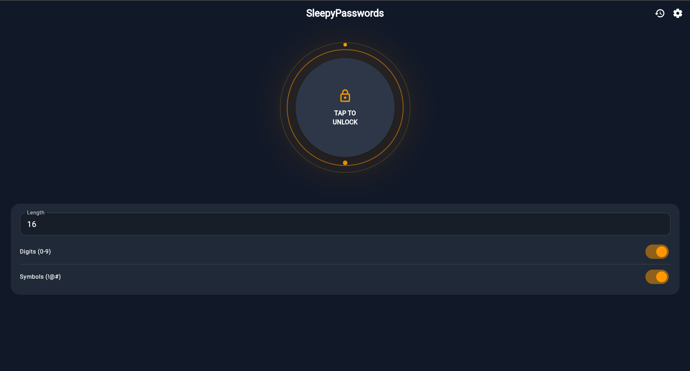

# SleepyPasswords 😴

[](https://github.com/onlyascend01-ai)
[](https://flutter.dev)
[](LICENSE)

A modern, cross-platform password generator with a calming, sleep-enhanced UI. Designed for night owls and minimalists.

## 📱 Screenshots

<div align="center">
  
</div>

> *Tip: Take a screenshot of the app running and save it as `screenshots/app-preview.png`!*

## ✨ Features

- **Pop Lock UI**: A unique, satisfying circular interface for generating passwords.
- **Sleep-Enhanced Design**: Default dark mode with soft colors to reduce eye strain at night.
- **Secure**: Uses cryptographically secure random number generation.
- **Customizable**: Toggle digits, symbols, length, and exclude ambiguous characters.
- **History**: Quickly access your last 10 generated passwords.
- **Auto-Copy**: Automatically copy passwords to clipboard upon generation.
- **Cross-Platform**: Runs smoothly on iOS, Android, and Web.

## 🚀 Getting Started

1.  **Clone the repository:**
    ```bash
    git clone https://github.com/onlyascend01-ai/SleepyPasswords.git
    cd SleepyPasswords
    ```

2.  **Install dependencies:**
    ```bash
    flutter pub get
    ```

3.  **Run the app:**
    ```bash
    flutter run
    ```
    *(Use `flutter run -d chrome` for web)*

## 🛠️ Project Structure

- `lib/main.dart`: App entry point.
- `lib/ui/home_page.dart`: The main "Pop Lock" interface.
- `lib/ui/settings_page.dart`: Configuration screen.
- `lib/core/password_generator.dart`: Logic for secure generation.
- `lib/ui/theme.dart`: Custom sleep-friendly themes.

## 🤝 Contributing

Contributions are welcome! Please feel free to submit a Pull Request.

---
Made with 🧡 by **Lux**.
